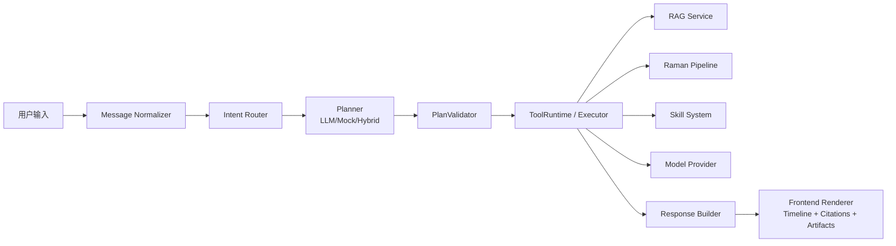
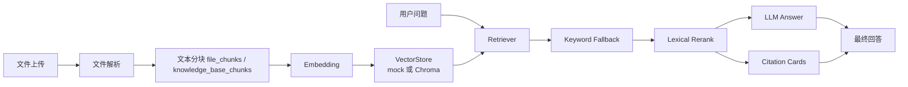
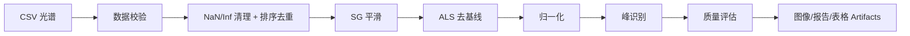

# RamanAgent：面向 Raman 光谱分析的 Multi-Skill Agent 平台

RamanAgent 是一个基于 FastAPI + 原生前端的 Multi-Skill Agent 项目，面向 Raman 光谱文件分析、文档问答和工具编排场景。它把普通聊天、文件 RAG、知识库 RAG、mixed RAG、Raman Pipeline、Skill、Tool Runtime、模型切换、任务中心和报告产物放到同一套可观察执行链路中。

## 1. 项目背景

普通 LLM 不擅长直接可靠处理专业光谱 CSV、实验报告和多文件知识库；传统 Raman 脚本虽然能做算法处理，但缺少自然语言交互、权限边界、执行轨迹和统一结果展示。RamanAgent 的目标是把专业文件解析、可信 RAG、Raman 算法 Pipeline 和 Agent 工具调用整合成一个可演示、可测试、可讲清楚的工程项目。

## 2. 功能状态

| 能力 | 状态 | 说明 |
| --- | --- | --- |
| 普通聊天 | ✅ 已实现 | 支持多模型配置；没有 API Key 时返回明确降级提示或走本地测试链路。 |
| 多模型平台切换 | ✅ 已实现 | SenseNova、OpenAI、Qwen、Zhipu、SiliconFlow、Gemini、Ollama 等 OpenAI-compatible 配置入口。 |
| 文件上传与解析 | ✅ 已实现 | 支持 TXT/MD/CSV/Excel/PDF/DOCX/PPTX/JSON/代码等处理器，解析结果写入 chunk 表。 |
| 会话文件 RAG | ✅ 已实现 | 文件分块、Embedding、向量索引、关键词 fallback、rerank、citation 返回。 |
| 知识库 RAG | ✅ 已实现 | 支持知识库文件、重建索引、会话绑定与权限过滤。 |
| mixed RAG | ✅ 已实现 | 联合检索会话文件和绑定知识库，保留来源类型、source_breakdown 和 rerank 信息。 |
| RAG 引用展示 | ✅ 已实现 | 返回 source_type、file_name、page/sheet/section、score/关键词匹配、excerpt。 |
| Graph Runtime 执行轨迹 | ✅ 已实现 | 后端输出 start/status/planner/tool_start/tool_progress/tool_result/final/done，前端展示时间线。 |
| LLM Planner + 规则 fallback | ✅ 已实现 | 支持 off/mock/llm/hybrid；PlanValidator 阻止虚构工具和越权文件。 |
| Tool Runtime | ✅ 已实现 | 参数校验、权限、文件作用域、confirmation、timeout、retry、audit log、统一错误码。 |
| Raman Pipeline Builder | ✅ 已实现 | 内置模板、自定义步骤、运行历史、步骤指标、图像 artifacts。 |
| Raman 传统算法节点 | ✅ 已实现 | SG、ALS、基线扣除、归一化、峰识别、质量评估等可运行。 |
| CDAE/CAE+/Autoencoder | 🚧 规划中 | 缺少真实模型文件时 available=false，不会伪造深度学习结果。 |
| MCP Runtime | 🧪 实验性 | 已有 registry/adapter 和错误码，实际 MCP server 连接仍是阶段性不可用。 |
| OCR | ⚠️ 需要额外依赖 | 图片/扫描 PDF OCR 需要 Tesseract/Poppler 等系统依赖。 |
| PDF 导出 | ⚠️ 需要额外依赖 | WeasyPrint/Playwright 可选；默认 html/none 不伪装成 PDF。 |
| PostgreSQL | 🚧 规划中 | 当前运行时内置 SQLite；DATABASE_URL 的 PostgreSQL 是预留接口。 |

## 3. 技术架构



Graph Runtime 节点：Normalize / Context / Intent / Planner / Validate / Execute / Observe / Repair / HumanConfirm / FinalAnswer。

## 4. RAG 流程



开发/CI 默认可以使用：

```env
VECTOR_DB_PROVIDER=mock
EMBEDDING_PROVIDER=mock
```

Demo/production 推荐：

```env
VECTOR_DB_PROVIDER=chroma
VECTOR_DB_DIR=storage/vector_db
EMBEDDING_PROVIDER=local
EMBEDDING_MODEL=BAAI/bge-small-zh-v1.5
RAG_TOP_K=6
RAG_SCORE_THRESHOLD=0.25
RAG_ENABLE_KEYWORD_FALLBACK=true
RAG_ENABLE_RERANK=true
RAG_RERANK_PROVIDER=lexical
```

手动验证真实 Chroma + local embedding：

```powershell
python -B scripts\verify_real_rag.py
```

该脚本会强制设置 `VECTOR_DB_PROVIDER=chroma`、`EMBEDDING_PROVIDER=local`，并使用 `BAAI/bge-small-zh-v1.5` 写入/检索一段验证文本。如果 `chromadb`、`sentence-transformers`、模型下载或模型加载失败，脚本会直接返回清晰错误，不会静默 fallback 到 mock。CI 默认不运行该脚本，避免外网模型下载影响流水线。

脚本默认使用独立 Chroma collection：`VECTOR_DB_COLLECTION=ramanagent_real_rag_verify`。业务运行默认仍使用 `ramanagent_rag_chunks`。如果切换过 embedding 模型维度，例如从 384 维 mock/旧模型切到 512 维 BGE，需要重建对应 collection，否则 Chroma 会拒绝混写不同维度向量。

## 5. Raman Pipeline 流程



可演示数据位于 `data/demo/`：

- `raman_demo_valid.csv`
- `raman_demo_with_noise.csv`
- `raman_demo_invalid.csv`

## 6. 快速启动

```powershell
python -m venv .venv
.venv\Scripts\Activate.ps1
python -m pip install --upgrade pip
pip install -r requirements.txt
Copy-Item .env.example .env
python -m scripts.preflight_check
python -m uvicorn backend.main:app --host 127.0.0.1 --port 8000 --reload
```

前端入口：

- http://127.0.0.1:8000/app/index.html
- 健康检查：http://127.0.0.1:8000/health

## 7. Docker 启动

```powershell
docker compose up --build
```

正式 `docker-compose.yml` 默认按 demo/production 风格配置 Chroma + local embedding。首次使用本地 embedding 可能需要下载模型；如果下载失败，RAG health 和手动验证脚本会报告明确错误。

开发模式可使用 mock provider：

```powershell
docker compose -f docker-compose.dev.yml up --build
```

该模式适合离线开发和 CI 类验证，不代表真实语义检索效果。

## 8. 测试与验收

```powershell
python scripts/check_env_safety.py
python -m scripts.preflight_check
python -m pytest -q
.\scripts\smoke_check.ps1
```

真实 Chroma + local embedding 手动验收：

```powershell
python -B scripts\verify_real_rag.py
```

## 9. Demo 场景

### 普通聊天

打开前端，输入：

```text
你好，请介绍一下你能做什么。
```

预期：返回普通助手回答，不触发 Raman 或 RAG。

### 文档 RAG

1. 上传 Markdown/PDF/DOCX。
2. 等待解析、分块和索引。
3. 提问文档内容。
4. 查看回答下方的引用来源卡片。

### mixed RAG

1. 创建知识库并上传资料。
2. 重建知识库索引。
3. 绑定知识库到当前会话。
4. 上传会话文件。
5. 使用 mixed RAG 提问，同时查看 conversation_file 与 knowledge_base 来源。

### Raman Pipeline

1. 上传 `data/demo/raman_demo_valid.csv`。
2. 选择 `basic_preprocessing`。
3. 执行 SG 平滑、ALS 去基线和归一化。
4. 运行 `peak_analysis` 查看峰识别图。
5. 运行 `quality_check` 查看质量指标。
6. 查看 artifacts 和报告摘要。

### Benchmark

```powershell
python -m scripts.run_raman_benchmark --input data/demo/raman_demo_valid.csv
python -m scripts.run_demo_benchmark --iterations 3
```

## 10. 当前可演示能力

- 普通聊天与多模型配置。
- 上传文档后建立 RAG 索引并返回真实引用。
- 会话文件 + 知识库 mixed RAG。
- Raman CSV 基础预处理、峰识别、质量评估与图像产物。
- Agent 执行轨迹、工具结果、RAG 引用和 artifacts 展示。
- mock provider 下的 CI、pytest、smoke check。

## 11. 当前限制

- 外部大模型需要 API Key。
- 本地 embedding 首次运行可能需要下载模型。
- OCR 需要 Tesseract/Poppler 等额外系统依赖。
- CDAE/CAE+/Autoencoder 节点需要真实模型文件后才能启用。
- SQLite 适合单机演示，生产环境建议升级为服务端数据库。
- MCP Runtime 当前是实验性连接层，不作为生产可用能力宣传。

## 12. Demo 截图

建议截图放在 `docs/assets/demo/`：

- `chat.png`：普通聊天。
- `upload_status.png`：文件上传、解析和索引状态。
- `rag_citations.png`：RAG 引用来源卡片。
- `mixed_rag.png`：conversation_file + knowledge_base 来源。
- `raman_pipeline.png`：Raman Pipeline 步骤与图像 artifact。
- `agent_timeline.png`：执行轨迹时间线。

目录说明见 `docs/assets/demo/README.md`。截图不是 CI 必需产物，可以手动生成，也可以用本机浏览器自动化保存到该目录。

## 13. 简历亮点

1. 设计 Multi-Skill Agent 分层架构，统一编排普通聊天、RAG、表格工具、Raman Pipeline 和 Skill 调用。
2. 实现会话文件、知识库和 mixed RAG，支持 Chroma/local embedding、关键词 fallback、lexical rerank 和 citation 展示。
3. 构建 Tool Runtime 安全边界，覆盖 schema 校验、权限、文件作用域、confirmation、timeout、retry 和 audit log。
4. 将 Raman 传统算法封装为可组合 Pipeline 节点，支持模板、自定义链路、运行历史、质量指标和图像产物。
5. 完善 Docker、CI、preflight、smoke check、pytest、demo 数据与 benchmark，让项目可复现、可验收、可演示。
